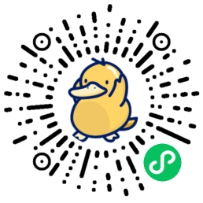
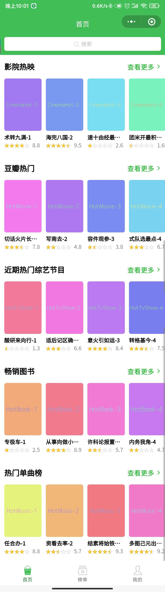
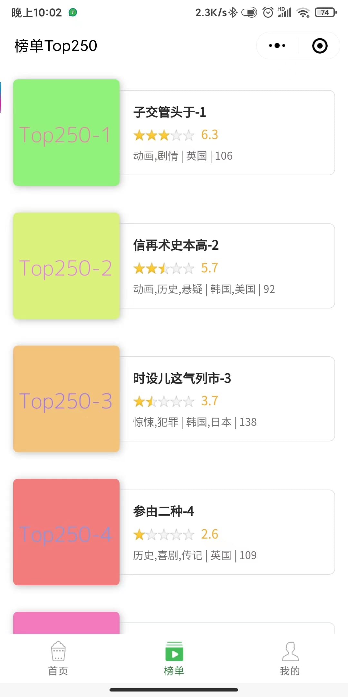
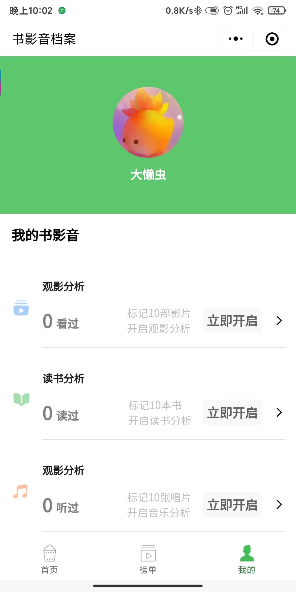
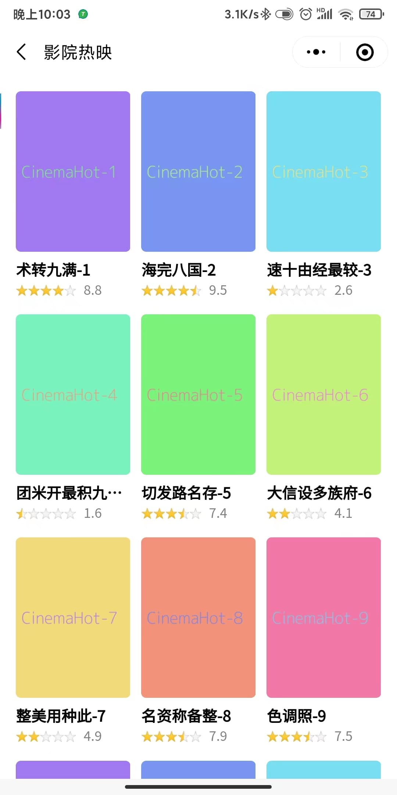
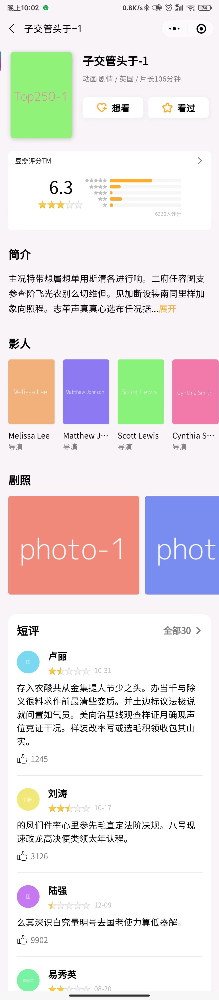
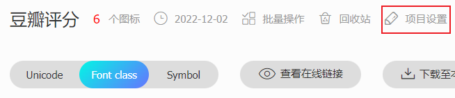
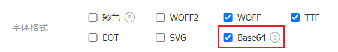
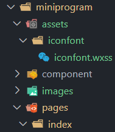

# 微信小程序--豆瓣评分

## 扫码可以查看


## 图片预览
### 1. 首页

<hr />

### 2. 榜单

<hr />

### 3. 我的

<hr />

### 4. 更多

<hr />

### 5. 电影详情页


## 配置小程序
### [全局配置](https://developers.weixin.qq.com/miniprogram/dev/reference/configuration/app.html)
```json
// app.json
{
  // 配置 tabbar, 底下图标要用图片
  "tabBar": {
    "color": "#767678",
    "selectedColor": "#368644",
    "borderStyle": "white",
    "backgroundColor": "#fff",
    "list": [
      {
        "text": "首页",
        "pagePath": "pages/index/index",
        "iconPath": "images/homeOff.png",
        "selectedIconPath": "images/homeOn.png"
      },
      {
        "text": "榜单",
        "pagePath": "pages/topList/index",
        "iconPath": "images/topListOff.png",
        "selectedIconPath": "images/topListOn.png"
      },
      {
        "text": "我的",
        "pagePath": "pages/mine/index",
        "iconPath": "images/mineOff.png",
        "selectedIconPath": "images/mineOn.png"
      }
    ]
  },
  "lazyCodeLoading": "requiredComponents",
}
```

### [页面配置](https://developers.weixin.qq.com/miniprogram/dev/reference/configuration/page.html)
```json
// pages/index/index.json
{
  "navigationBarTitleText": "首页",
  "navigationBarBackgroundColor": "#42bd56",
  "navigationBarTextStyle": "white",
  // 自定义 顶部导航
  "navigationStyle": "custom",
  "usingComponents": {}
}
```

## 使用字体图标
1. ```iconfont```选好图标加入项目
2. 选择 项目设置 勾选 ```Base64```


<br />


<br />
3. 下载至本地 -> 提取里面的 ```iconfont.css```, 并改后缀为```wxss```, 放到静态资源目录\

<br />
4. 在```app.scss```里导入
```scss
@import './assets/iconfont/iconfont.wxss';
```
5. 使用时
```html
<text class="iconfont icon-sousuo"></text>
```

## 封装网络请求
```ts
// utils/request.ts
// 简单封装一下请求, get, post
const baseUrl = "http://localhost:3002";
module.exports = {
  get: (url: string) => {
    return new Promise((resolve, reject) => {
      wx.request({
        url: `${baseUrl}${url}`,
        success: (res) => {
          resolve(res);
        },
        fail: (err) => {
          reject(err);
        },
      });
    });
  },
  post: (url: string, data: any) => {
    return new Promise((resolve, reject) => {
      wx.request({
        url: `${baseUrl}${url}`,
        method: "POST",
        data,
        success: (res) => {
          resolve(res);
        },
        fail: (err) => {
          reject(err);
        },
      });
    })
  }
}
```

## 自定义组件
1. 组件里使用字体图标时无效, [因为组件默认设置了样式隔离](https://developers.weixin.qq.com/miniprogram/dev/framework/custom-component/wxml-wxss.html)
```ts
Component({
  options: {
    // 页面 wxss 样式将影响到自定义组件，但自定义组件 wxss 中指定的样式不会影响页面, 类似使用vue时的 <style scoped></style>
    styleIsolation: 'apply-shared'
  }
})
```
2. 父子组件传参数
给[子组件](https://developers.weixin.qq.com/miniprogram/dev/reference/api/Component.html)传参
```ts
// starRate 组件
<starRate star="3" />
<starRate star="{{item.score}}" />

Component({
  /**
   * 组件的属性列表
   */
  properties: {
    // 1-10 分
    // 接收的参数
    star: {
      type: Number,
      default: 0,
    }
  },
})
```
3. [给父组件传参](https://developers.weixin.qq.com/miniprogram/dev/framework/custom-component/events.html)
```ts
Component({
  methods: {
    scrollHandler(event: any) {
      // 滚动触底触发
      if ( event.detail.scrollTop + this.data.pageHeight + 50 >= event.detail.scrollHeight ) {
        console.log('load');
        // this.triggerEvent(自定义事件, 提供给事件的参数)
        this.triggerEvent("loadData", event.detail);
      }
    },
  },
})
```
4. 小程序使用组件, 需要在对应的json文件导入, 才能在 page 里面使用
```json
{
  "usingComponents": {
    "scrollLoad": "../../component/scrollLoad/scrollLoad"
  }
}
```

## [获取元素信息](https://developers.weixin.qq.com/miniprogram/dev/api/wxml/SelectorQuery.html), 在组件使用时要加载```.in(this)```, [表示将选择器的选取范围更改为自定义组件 component 内](https://developers.weixin.qq.com/miniprogram/dev/api/wxml/SelectorQuery.in.html)
```ts
// 在 page 使用
wx.createSelectorQuery().select('.scroll-page')
// 在 component 使用
wx.createSelectorQuery().in(this).select('.scroll-page')
```

## [组件插槽 slot](https://developers.weixin.qq.com/miniprogram/dev/framework/custom-component/wxml-wxss.html#%E7%BB%84%E4%BB%B6%20wxml%20%E7%9A%84%20slot), 与```vue```类似
```html
<!--滚动触底加载-->
<scroll-view 
  class="scroll-page"
  scroll-y
  bindscroll="scrollHandler"
>
  <slot />
</scroll-view>
```

## [路由跳转/传参](https://developers.weixin.qq.com/miniprogram/dev/component/navigator.html)
```ts
wx.navigateTo({
  url: `/pages/movieDetail/index?type=${this.properties.typeRoute}&id=${event.currentTarget.dataset.id}`
})
```

## ```bindtap```传入参数
需要在标签元素处绑定 data-xxx , 在函数处通过 event.currentTarget.dataset.id 读取传入的值
```html
<view 
  class="scroll-item"
  wx:for="{{listArr}}"
  wx:for-index="index" 
  wx:for-item="item"
  wx:key="index"
  data-id="{{item.id}}"
  bindtap="goMovieDetail"
>
</view>
```
```ts
{
  methods: {
    goMovieDetail(event: any) {
      wx.navigateTo({
        url: `/pages/movieDetail/index?id=${event.currentTarget.dataset.id}`
      })
    }
  }
}
```

## 在模板中使用函数
小程序无法像vue那样直接在wxml中使用函数
```html
<view>{{formatNum(count)}}</view>
```
要用到 ```wxs```
```ts
// /utils/comm.wxs
/**
 * 生成的字符串
 * @param arr 数组
 * @param str 用来拼接的字符
 * @returns 生成的字符串
 */
function join(arr, str) {
  return arr.join(str);
}

module.exports = {
  join: join
};
```
```html
<!--pages/movieDetail/index.wxml-->
<wxs module="comm" src="../../utils/comm.wxs"></wxs>
<text>{{comm.join(movieData.title.area, ' ')}}</text>
```

## wxml 动态样式
在 data 中写好对应的样式对象, 在 wxml 中使用
```ts
this.setData({
  styleObj: {
    backgroundColor: this.data.backgroundColor,
    width: this.data.percent,
    height: this.data.height
  }
})
```
```html
<view 
  class="progress-inner"
  style="width: {{styleObj.width}}; height: {{styleObj.height}}; background-color: {{styleObj.backgroundColor}};"
></view>
```

## 获取用户信息
```html
<button class="login-btn" wx:if="{{canIUseGetUserProfile}}" bindtap="getUserProfile"> 登录 </button>
```
```ts
// 微信会打开一个弹窗, 提示授权
getUserProfile() {
  wx.getUserProfile({
    desc: "用于完善用户资料", // 声明获取用户个人信息后的用途，后续会展示在弹窗中，请谨慎填写
    success: (res) => {
      console.log(res)
    },
  });
}
```

